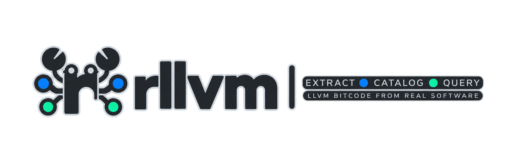

# rllvm



[](https://github.com/h1994st/rllvm/actions/workflows/ci.yml)
[](https://codecov.io/github/h1994st/rllvm)
[](https://crates.io/crates/rllvm)

Extract whole-program LLVM bitcode from any build.

Point your build system at rllvm's compiler wrappers, build normally, then pull a
single `.bc` for the whole program back out of the finished binary.

## Quick start

```bash
brew install h1994st/tap/rllvm llvm   # macOS or Linux with Homebrew
# Or: cargo install rllvm
# LLVM on Ubuntu/Debian: sudo apt install llvm llvm-dev clang libclang-dev
```

```bash
rllvm-cc hello.c -o hello
rllvm-get-bc hello       # writes hello.bc
rllvm-info hello.bc      # target, function, block, instruction counts
```

On first run, tool paths are detected from `llvm-config` and written to
`~/.rllvm/config.toml`.

## Claude Code plugin

In Claude Code, the rllvm plugin covers the whole workflow, from installing
rllvm to reading an answer:

```text
/plugin marketplace add h1994st/rllvm
/plugin install rllvm@rllvm
```

| Part | What it does |
| --- | --- |
| `setup` skill | Installs `rllvm` and `rllvm-query` with your approval, picks an LLVM every reader of the bitcode accepts, configures, and troubleshoots |
| `capture` skill | Chooses how to capture your build — C, C++, Objective-C, Rust, mixed, a compilation database, cross, WebAssembly, eBPF — and what to extract |
| `query` skill | Picks the query that answers your question and reports what the answer does not cover |
| MCP server | `rllvm-query mcp`, configured automatically |
| Cache warning | A `PostToolUse` hook notes once per session when the facts cache passes `query_cache_warn_mb`; needs `jq` |

Builds run as ordinary shell commands you approve, never inside the server.
See the [plugin example](examples/claude-plugin/).

## Coming from wllvm or gllvm?

rllvm follows the `CC`/`CXX` → build → extract workflow that
[wllvm](https://github.com/travitch/whole-program-llvm) and
[gllvm](https://github.com/SRI-CSL/gllvm) established. `rllvm-cc` and
`rllvm-cxx` stand in for `wllvm`/`gclang`, `rllvm-get-bc` for
`extract-bc`/`get-bc`.

Your build commands do not change. What you can capture, and what you can do
with it afterwards, does.

| | 🌟 rllvm | wllvm / gllvm |
| --- | --- | --- |
| 🦀 Languages | [C, C++, Objective-C, **Rust**](#languages) | C, C++, Fortran |
| 🔍 Analysis | [Source-level queries, MCP server](#analyzing-bitcode) | ❌ |
| 🤖 Agents | [Claude Code plugin: setup, capture, queries](#claude-code-plugin) | ❌ |
| 📋 No wrapper build | [Import `compile_commands.json`](#from-a-compilation-database) | ❌ |
| 🎯 Targets | [Native, cross, **WebAssembly, eBPF**](#cross-compilation) | Native; cross with a target `objcopy` |
| 🔗 LTO | [Three modes, dispatched on object content](#lto) | `-flto` unlikely to survive extraction |
| ♻️ Rebuilds | [Cache validated against inputs](#caching) | No bitcode cache |
| 📦 Moving a build tree | [Paths relative to a root](#moving-a-build-tree) | Absolute bitcode paths |
| ⚙️ Setup | [Detected from `llvm-config`](#configuration) | Environment variables |

## How it works

The wrappers run Clang normally and also emit bitcode. Each object gets a custom
section recording its bitcode path. The linker concatenates those sections, so
the finished binary carries a list of every module that went into it; extraction
reads the paths back out and merges the modules.

```text
source.c → rllvm-cc → object + bitcode
                         ↓
                      linker → executable
                                   ↓
                              rllvm-get-bc → whole-program.bc
```

Rust captures bitcode per crate: linked crates carry paths through a marker
object, library crates in archive members.

This is why capture only covers what you build through the wrappers. Linking a
prebuilt native library contributes no bitcode, so build every dependency you
need for a whole-program view.

## Capturing bitcode

### Languages

#### C, C++ and Objective-C

`rllvm-cc` wraps `clang` and `rllvm-cxx` wraps `clang++`. Objective-C (`.m`) and
Objective-C++ (`.mm`) sources go through the same two wrappers.

```bash
rllvm-cc hello.m -o hello -framework Foundation
rllvm-get-bc hello       # writes hello.bc
```

```bash
# Autotools
CC=rllvm-cc CXX=rllvm-cxx ./configure && make
rllvm-get-bc path/to/program

# CMake
CC=rllvm-cc CXX=rllvm-cxx cmake -S . -B build && cmake --build build
rllvm-get-bc build/my_program
```

Add `OBJC=rllvm-cc OBJCXX=rllvm-cxx` for Objective-C projects. CMake also
accepts `-DCMAKE_TOOLCHAIN_FILE=path/to/rllvm/cmake/rllvm-toolchain.cmake`,
which sets all four compilers; see the [CMake](examples/cmake/) and
[Objective-C](examples/objc/) examples.

#### Rust

```bash
RUSTC_WRAPPER=rllvm-rustc cargo build
rllvm-get-bc target/debug/my_program
```

Wrapped dependency crates contribute modules when their archive members reach
the link. You can also extract an `.rlib` directly, or invoke the wrapper
without Cargo:

```bash
rllvm-get-bc 'target/debug/deps/libmylib-<hash>.rlib'
rllvm-rustc main.rs -o app && rllvm-get-bc app
```

`cargo check` and procedural-macro crates pass through without capture, and
prebuilt dependencies — including the standard library — are not rebuilt. Your
LLVM readers must be compatible with the version `rustc -vV` reports. Use
`RLLVM_LOG_LEVEL=3` for diagnostics under Cargo.

See the [Rust example](examples/rust/).

### Wrapper options

Every compiler flag reaches the real compiler, including `-c`, `-v`, `--help`
and `--version`. Wrapper options are long-only, prefixed `--rllvm-`, and go
first:

```text
--rllvm-compiler <PATH>   Override clang/clang++ (C/C++ wrappers only)
--rllvm-verbose[=LEVEL]   Bare flag is 1; 3 logs subcommands, 4 enables trace
--rllvm-help              Print wrapper help
--rllvm-version           Print wrapper version
```

```bash
rllvm-cc --rllvm-verbose=3 -pthread -c hello.c -o hello.o
rllvm-cc @compile.rsp
```

Response files follow Clang's GNU UTF-8 syntax, including quoting and nested
references. Large generated commands use them automatically.

See the [wrapper options example](examples/wrapper-options/).

### From a compilation database

`rllvm-compdb` compiles selected entries from an existing
`compile_commands.json`, so you can capture bitcode without rebuilding through
the wrappers:

```bash
rllvm-compdb list build/ > compilations.json
rllvm-compdb generate build/ --source src/example.c --output-dir analysis/example
```

`list` reports entry and configuration IDs without compiling. `generate` takes
all entries by default; repeat `--source` or `--entry` to narrow, and combine
them to intersect. Only direct `clang`/`clang++` drivers are supported, and the
output directory must be new.

These modules describe the **current source tree**, not membership in a real
link. Use wrapper capture when participation in the actual build matters.

See the [compilation database example](examples/compdb/).

### Caching

Off by default. `RLLVM_CACHE=1` enables it, storing in `~/.rllvm/cache`:

```bash
RLLVM_CACHE=1 cmake --build build
```

Native compilation still runs — a hit only skips the extra bitcode compilation,
after checking preprocessed inputs, dependencies, compiler, command, directory
and environment. Keep it off when side inputs that preprocessing cannot see,
such as optimization profiles, change between builds.

### Build modes and targets

#### Linkers

The platform's default linker and [LLD](https://lld.llvm.org/) both work.
`-fuse-ld=lld` selects `ld64.lld` on macOS and `ld.lld` on Linux:

```bash
rllvm-cc -fuse-ld=lld lib.c app.c -o app
rllvm-get-bc app -o app.bc
```

See the [LLD example](examples/lld/).

#### LTO

Select `lto_mode` in the config or `RLLVM_LTO_MODE`, and use the same mode when
compiling and linking:

| Mode | Captured bitcode | Support |
| --- | --- | --- |
| `marker` (default) | Per-source modules recorded in LTO objects | Full/ThinLTO; ELF/Mach-O; C/C++ |
| `save-temps` | Full-LTO linker's merged, optimized module | Separate links and combined source/link invocations |
| `skip` | No additional capture; emits a warning | Explicitly disabling capture for LTO |

```bash
RLLVM_LTO_MODE=save-temps rllvm-cc -flto hello.c -o hello
rllvm-get-bc hello -o hello.bc
```

`save-temps` needs real LTO inputs — adding `-flto` only at link time is not
enough — and ThinLTO has no single merged module, so use `marker` for it.
A static library of `-flto` objects extracts without linking: its members are
bitcode, and each one is taken as a module.
COFF and WebAssembly reject `marker` and direct you to `skip`.

See the [LTO example](examples/lto/).

#### Cross-compilation

Pass `--target=<triple>` as you would to Clang. The triple reaches the link as
well as the compile, so a one-shot build works:

```bash
rllvm-cc --target=aarch64-unknown-linux-gnu -fuse-ld=lld -nostdlib \
  lib.c app.c -o app
rllvm-get-bc app -o app.bc     # app.bc carries the cross triple
```

The recorded section follows the object's format, not the host's, so a Linux
ELF built on macOS extracts like any other. Linking ELF off a non-ELF host
needs LLD, and libc needs a sysroot as usual. Set `llvm_objcopy_filepath` for
targets the internal fallback does not model, such as RISC-V.

Universal (multiple `-arch`) builds are unsupported; build and extract one
architecture at a time.

See the [cross-compilation example](examples/cross-compile/).

##### WebAssembly and eBPF

```bash
rllvm-cc --target=wasm32-unknown-unknown -nostdlib -Wl,--no-entry \
  lib.o main.o -o app.wasm
rllvm-get-bc app.wasm -o app.bc

rllvm-cc --target=bpf -O2 -g -c prog.c -o prog.o
rllvm-get-bc prog.o -o prog.bc
```

WebAssembly linking needs a matching `wasm-ld` from LLD; see the
[WebAssembly example](examples/wasm/). eBPF works without special handling:
libbpf skips rllvm's section on load and preserves it through linking. That
linker requires BTF, so compile with `-g`; see the [eBPF example](examples/ebpf/).

## Extracting bitcode

### Merge strategies

```bash
rllvm-get-bc app                                # one whole-program .bc
rllvm-get-bc --merge-strategy archive libfoo.a  # writes libfoo.bca
rllvm-get-bc --merge-strategy partial app       # merge by directory, then combine
rllvm-get-bc -m app                             # also write app.bc.manifest
```

`rllvm-get-bc` accepts executables, objects and archives, and `-o` chooses the
output path. The default links every module into one `.bc`; `-b` is shorthand
for archive mode. Archive outputs are rewritten from the current modules, so
removed members do not persist.

See the [merge strategies example](examples/merge-strategies/).

### Catalogs

A catalog is a JSON record of which modules were found and where they came from.
Use one to select a subset, or to feed [queries](#analyzing-bitcode):

```bash
rllvm-info app --json > catalog.json
rllvm-get-bc app --module MODULE_ID --output-dir analysis/selected
rllvm-get-bc analysis/selected/catalog.json -o selected.bc
```

`--module`, `--source` and `--configuration` are repeatable: alternatives within
one option combine, different options intersect, and an unmatched selector
fails. `--output-dir` must be new, and copies hash-checked modules into it with
relative paths so the directory can move.

A catalog describes the evidence it collected and the scope it selected — not
proven whole-program completeness. See the [format reference](docs/CATALOG.md)
and the [catalogs example](examples/catalogs/).

### Moving a build tree

Recorded paths are absolute by default. Record them relative to a root instead,
then supply that root's new location:

```bash
RLLVM_BITCODE_ROOT="$PWD/build" cmake --build build
# after moving build/ to moved-build/:
rllvm-get-bc --bitcode-root moved-build moved-build/my_program
```

The root must contain the bitcode files, including a central
`bitcode_store_path` if you use one. A root that cannot contain the bitcode is
reported rather than silently ignored. See the
[relocatable example](examples/relocatable/).

## Analyzing bitcode

### Queries

`rllvm-query` answers source-level questions about captured bitcode. It links
LLVM statically, so it ships as its own crate and formula:

```bash
brew install h1994st/tap/rllvm-query   # brings its own llvm
# Or: cargo install rllvm-query
# If llvm-config is not on PATH: LLVM_SYS_231_PREFIX="$(brew --prefix llvm)"
```

On Ubuntu/Debian, install `libpolly-N-dev` alongside `llvm-N-dev` and
`libclang-N-dev`.

```bash
rllvm-query --catalog catalog.json defs parse_frame            # where it is defined
rllvm-query --catalog catalog.json at parser.c 4               # what is at a source line
rllvm-query --catalog catalog.json callers parse_frame         # who calls it
rllvm-query --catalog catalog.json callees main                # what it calls
rllvm-query --catalog catalog.json uses parse_frame            # where its address is taken
rllvm-query --catalog catalog.json reach main parse_frame      # a path between two functions
rllvm-query --catalog catalog.json closure parse_frame in      # everything that reaches it
rllvm-query --catalog catalog.json externals                   # unbound symbols
rllvm-query --catalog catalog.json ffi-exports                 # Rust functions C can call
rllvm-query --catalog catalog.json indirect-targets parser.c:8 # targets of an indirect call
rllvm-query --catalog catalog.json resolution-candidates       # indirect calls grouped by field, with candidates
```

An indirect call site, and an address stored or placed in a table, names the
record field it goes through (`via ops@8 (on_event)`, `into ops@8`) when the
IR proves one; the member name needs `-g`.

Answers print as text. Add `--json` for the full machine-readable envelope, or
`--full` to print the scope, analysis, uncertainty and provenance blocks as
text too. The MCP server always speaks JSON.

Each invocation loads the whole catalog. To ask many questions, pipe them in,
one per line, and the catalog loads once:

```bash
printf '%s\n' 'callees main' 'callers parse_frame' \
  | rllvm-query --catalog catalog.json
```

Each answer follows a `== <query>` line; with `--json`, each is one line of
JSON. Every line is checked before the catalog is read.

Each answer's `analysis.cache` (and `--full`) reports hits, misses and disk
use. `RLLVM_QUERY_CACHE=0` turns it off.

```bash
rllvm-query cache               # the facts cache's location and disk use
rllvm-query cache clear         # delete every cached entry
rllvm-query cache clear --stale # delete only generations this binary no longer reads
```

An answer whose facts cache is over `query_cache_warn_mb` adds a footer note
naming `rllvm-query cache clear`.

Every answer carries the results plus what it could *not* see: which modules
failed to parse, which call sites are indirect, which symbols bind
ambiguously, and whether each location's source has changed since it was
compiled. See the [queries example](examples/queries/) and the [staleness
example](examples/staleness/).

A symbol can be named three ways — the mangled symbol, its demangled reading, or
a bare identifier that searches:

```bash
rllvm-query --catalog catalog.json defs _Z5twiceIiET_S0_
rllvm-query --catalog catalog.json defs 'int twice<int>(int)'
rllvm-query --catalog catalog.json defs twice
```

See the [name resolution example](examples/name-resolution/).

### Completing the call graph

An agent that resolves an indirect call (from `resolution-candidates`, say)
records it in an overlay: a JSON-lines file beside the catalog,
`<catalog stem>.overlay.jsonl` unless `--overlay PATH` names another. The
catalog itself is never changed.

```bash
echo '{"op":"add","via_field":{"record":"ops","offset":8},"to":"h3","confidence":"high","provenance":["init: o->on_event = h3"]}' \
  | rllvm-query --catalog catalog.json overlay record  # validate and append, all or none
rllvm-query --catalog catalog.json overlay list        # edges, verdicts, sites covered
rllvm-query --catalog catalog.json overlay compact     # rewrite as the current edges
```

An `add` names a field (`via_field`, every unresolved site through it) or one
`site`, and attaches only where LLVM left the call unbounded. `verify` and
`retract` name an edge's key. The file is bound to one build: after a rebuild
it refuses to load, naming both fingerprints, as it does when written by an
rllvm-query that numbers call sites differently, and a write refuses if
another writer changed the file since it was read. To start again after a
refusal, move or delete the file, or name another with `--overlay` (MCP:
`path`). Overlay edges are hypotheses, never proof, and no answer uses them
unless asked.

### MCP server

```bash
rllvm-query mcp
```

Serves the same queries as JSON-RPC 2.0 tools over stdio. Point a client at it:

```json
{
  "mcpServers": {
    "rllvm": {
      "command": "rllvm-query",
      "args": ["mcp"]
    }
  }
}
```

The client chooses what to analyze with `load_catalog` (a catalog JSON) or
`inventory` (a binary, archive or `.bc`), and can keep several loaded at once.
Each is analyzed once and answers from memory after that.

See the [MCP example](examples/mcp/). In Claude Code, the
[plugin](#claude-code-plugin) configures this server for you.

## Configuration

The TOML file lives at `$RLLVM_CONFIG` or `~/.rllvm/config.toml`.
`rllvm-init --dry-run` previews detection; `--llvm-prefix` chooses a toolchain
and `-o` selects the file to write.

<details markdown="1">
<summary>Configuration keys</summary>

| Key | Required | Description |
| --- | --- | --- |
| `llvm_config_filepath` | Yes | Absolute path to `llvm-config` |
| `clang_filepath` | Yes | Absolute path to `clang` |
| `clangxx_filepath` | Yes | Absolute path to `clang++` |
| `llvm_ar_filepath` | Yes | Absolute path to `llvm-ar` |
| `llvm_link_filepath` | Yes | Absolute path to `llvm-link` |
| `llvm_objcopy_filepath` | No | Absolute path to `llvm-objcopy`; preferred for embedding, with an internal fallback |
| `rustc_filepath` | No | Compiler for direct Rust invocation; `RLLVM_REAL_RUSTC` overrides; defaults to `rustc` on `PATH` |
| `bitcode_store_path` | No | Directory for bitcode files (must be absolute; created if missing) |
| `bitcode_root` | No | Record embedded paths relative to this root (default: absolute) |
| `llvm_link_flags` | No | Extra flags for `llvm-link` |
| `lto_ldflags` | No | Extra flags for link-time optimization |
| `bitcode_generation_flags` | No | Extra flags for bitcode generation (e.g. `-flto`) |
| `lto_mode` | No | How `-flto` builds record bitcode: `marker` (default), `save-temps`, `skip`; `RLLVM_LTO_MODE` overrides |
| `is_configure_only` | No | Skip extra C/C++ bitcode work (default: `false`) |
| `cache_enabled` | No | Reuse C/C++ bitcode across rebuilds; overridden by `RLLVM_CACHE` (default: `false`) |
| `cache_dir` | No | Cache directory; also holds rllvm-query's `query-facts/` (default: `~/.rllvm/cache`) |
| `query_cache` | No | Reuse rllvm-query's extracted per-module facts; overridden by `RLLVM_QUERY_CACHE` (default: `true`) |
| `query_cache_warn_mb` | No | Facts cache size, in MB, past which rllvm-query warns (default: `1024`) |
| `log_level` | No | 0=error (default), 1=warn, 2=info, 3=debug, 4+=trace; `RLLVM_LOG_LEVEL` overrides |

</details>

## Benchmarks

Clean build-only time relative to native compilation, on an Apple M4 with
LLVM 23.1.2:

| Workload | Cache disabled | Primed C/C++ cache |
|---|---:|---:|
| nghttp2 C (CMake) | 1.86× | 1.65× |
| nghttp2 C++ (CMake) | 1.88× | 1.28× |
| Quiche (Cargo) | 1.28× | 1.23× |

C/C++ capture adds a bitcode compilation per source; Rust emits bitcode in the
same rustc invocation. Unchanged rebuilds stay near native time, but extraction
repeats its merge every run.

See the [baseline](benchmarks/baselines/2026-10-03-apple-m4/README.md) for
conditions and the [benchmark guide](benchmarks/README.md) for reproduction.

## Related projects

[wllvm](https://github.com/travitch/whole-program-llvm) and
[gllvm](https://github.com/SRI-CSL/gllvm) built the wrapper-and-extract approach
this tool follows.

[rules_rllvm](https://github.com/h1994st/rules_rllvm) is a separate Bazel-native
project and does not use these binaries.

## License

[Apache-2.0](LICENSE)
